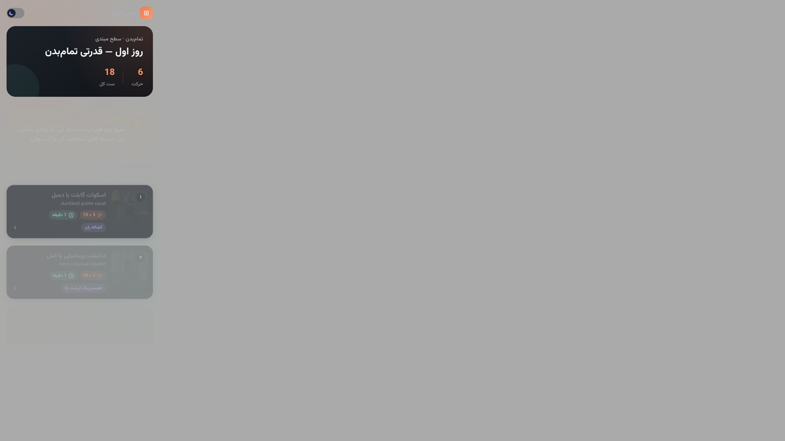
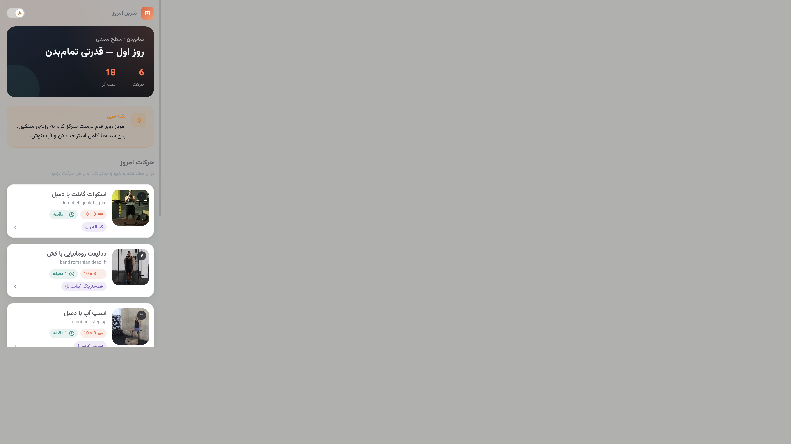
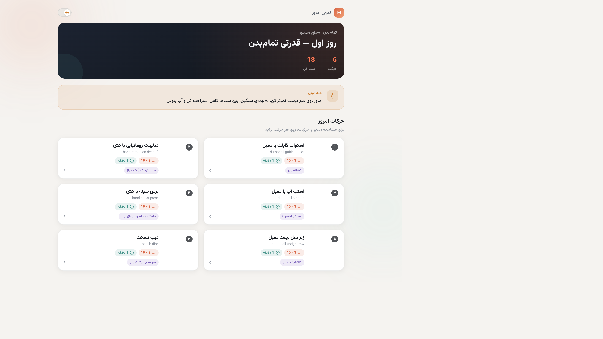

# تمرین امروز — Workout Day UI

صفحهٔ «تمرین امروز»؛ یک رابط کاربری موبایل‌فرست، RTL و responsive برای نمایش برنامهٔ تمرینی روزانه. داده‌ها مستقیم از `workout-day.json` خوانده می‌شوند — بدون بک‌اند.

## دمو آنلاین

**https://ali-ft.github.io/workout-day-ui/**

با هر push به `main`، GitHub Actions به‌صورت خودکار روی GitHub Pages deploy می‌کند.

## اجرا

```bash
# نیاز: Node.js 18+
npm install
npm run dev
```

مرورگر: [http://localhost:5173](http://localhost:5173)

```bash
npm run build   # ساخت نسخهٔ production
npm run preview # پیش‌نمایش build
```

برای تست build مشابه GitHub Pages:

```bash
VITE_BASE_PATH=/workout-day-ui/ npm run build
npm run preview
```

## اسکرین‌شات‌ها

| موبایل (تاریک) | موبایل (روشن) | دسکتاپ |
|---|---|---|
|  |  |  |

## تصمیم‌های طراحی

### پالت رنگ
- **Accent نارنجی-مرجانی** (`#E85D3A` / `#FF7247`): انرژی و حس ورزشی
- **Teal** برای زمان استراحت: تمایز بصری بین «کار» و «استراحت»
- **بنفش** برای تگ عضله: دسته‌بندی سریع بدون شلوغی
- **پس‌زمینهٔ گرم** در حالت روشن و **charcoal عمیق** در حالت تاریک

### چیدمان
- **Mobile First**: کارت‌های افقی با تصویر، نام، متادیتا و تگ عضله
- **دسکتاپ**: گرید ۲ ستونه با max-width محدود برای خوانایی
- **RTL کامل**: `dir="rtl"` در HTML + فونت Vazirmatn

### تعامل
- کلیک روی هر کارت → **bottom sheet** (موبایل) / **modal** (دسکتاپ) با ویدیو، عضلات، نکته مربی و دستورالعمل گام‌به‌گام
- **Dark Mode** با toggle و ذخیره در localStorage
- **Fallback تصویر** با آیکون سیلوئت و shimmer هنگام لود
- انیمیشن fade-up با stagger + `prefers-reduced-motion`

### ساختار کد
```
src/
├── components/   # PageHeader, CoachTip, ExerciseCard, ExerciseDetail, ...
├── hooks/        # useTheme
├── types/        # WorkoutDay, Exercise
├── utils/        # formatSetsReps, toPersianNumber, ...
└── data/         # workout-day.json
```

## استفاده از AI

- **Cursor (Claude)**: طراحی UI/UX، پیاده‌سازی کامل، CSS، و ساختار کامپوننت‌ها
- **AI برای تصمیم‌های طراحی**: انتخاب پالت رنگ، سلسله‌مراتب بصری، و micro-interactionها

## تکنولوژی

- React 19 + TypeScript
- Vite 6
- Tailwind CSS 4
- Lucide React (آیکون‌های استاندارد و خوانا)
- بدون routing، state management خارجی، یا UI library
